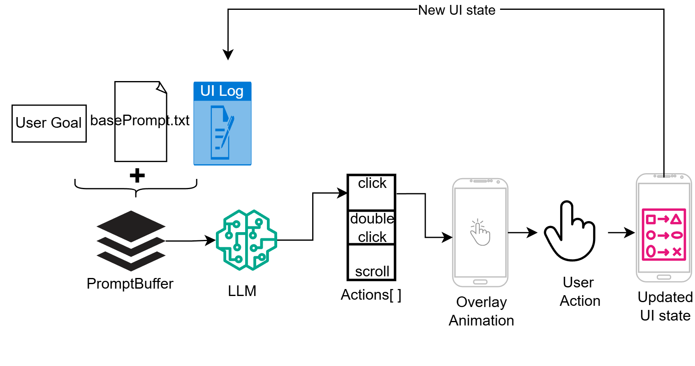

# **어디눌러 프로젝트**

디지털 취약계층을 위한 화면상의 네비게이션 앱(UI Navigator App.).

1. 반복 숙달을 통해 디지털 자립을 돕고자 함.
> gui agent에서 '행동'을 뺀 형태. 
2. 최종 목표는 경량 엣지모델을 통한 free-api-fee
> gemma4:e2b 까지는 성공했으나 성능이 미치지 못함(26.05.)

## **Operation Flow**

본 앱의 동작은 다음의 총 2가지 phase로 구분할 수 있다.

#### 1. 목표 설정 phase

사용자로부터 음성인식을 통해 최종 목표를 인식하고, 그 직후 LLM의 응답을 받기 까지의 과정.

- **사용자 입력**: 오버레이 버튼(아이콘) 터치 후 약 6초간 .m4a 음성파일로 녹음 및 저장.
- **STT**: STT 모델 호출 후, .m4a 파일 --> text로 변환.
- **LMM**: 프롬프트에 위의 text를 포함해 LLM에게 전송 후, 지시사항을 응답으로 받아옴. (아래 2개의 형식 중 하나)
    
    <형식 1>
    사용자의 최종 목표: 메시지를 아들에게 보내고 싶어.
    현재 목표: 메시지 앱을 실행하기 위해 먼저 앱 업데이트를 진행합니다.
    ui요소 id: ID: No ID(LN:14)
    행동: touch
    지시사항: 업데이트 버튼을 누르세요.

    <형식 2>
    목표달성! (추가적인 친절한 설명 문장)

- **애니메이션**: 사용자 터치(조작), 혹은 일정 시간동안 애니메이션을 지시사항에 맞게 화면에 띄움.

#### 2. 반복 phase

이미 목표는 받았고, 목표달성을 판단하기까지 반복되는 과정.

- **반복**: 앞선 phase 1 이후로, 사용자의 목표달성까지(LLM 판단) '사용자의 터치(조작)'~'응답' 반복.
> 이때, LLM에게 프롬프트를 전송하는 기준은 **UI state의 변경**이다.
> - UI state가 변했다는 건, 사용자의 조작이 선행했다는 가정이 있다.
> - 단, 실제 구현에서는 알림 다이얼로그 등을 고려하여 예외를 두었다.

---

## **To Do List**

#### **Frontend**

all activity & xm
- [x] main, splash, settings pages
- [x] exit button, setting button 구현
- [x] 녹음 버튼이자 오버레이로 띄우는 button
    - [x] 버튼 누르면 녹음 후, whisper에게 보내고, 응답 받기
    - [x] 응답을 특정 버퍼에 저장 <= 이후 제미나이 호출까지 논스톱 파이프라인 만들기
    - [x] 오버레이 버튼 움직일 수 있게 하기
    - [x] 오버레이 버튼과 통합

#### **resrouces**

- [x] imgs
- [x] animations
- [x] better prompts

#### **background**

- [x] overlay 구현하기
- [x] prompt 작성 / api 호출 
- [x] api를 토대로 애니메이션 구현

#### **Inner Logic**

- [x] understand how does LLM api work
- [x] api 호출 테스트
    - [x] gpt4o : 최종 결정/지시 담당
    - [x] whisper : 음성파일을 텍스트로 바꿔주는 담당

#### **Test**

- [x] 전체 과정 테스트(kakaotalk)
    - [x] 1차 테스트(간단한 "hi" 메시지 보내기)
    - [x] 2차 테스트(복잡한 메시지 전송 및 기본 프로필로 바꾸기)
    - [x] 3차 테스트(찾는 대상이 없을 때 - 사람, 앱)
    - [x] 최종 테스트: 1,2,3차 테스트 20번

- [x] 최종 테스트 
    - [x] gemma4:e4b fine-tuned(결과: 9/32)
    - [x] gpt-4o(api)(결과: 29/32) 

(26.05)

---

## 지금까지의 문제점

1. 파인튜닝(fine-tuning)용 데이터 부족
    - [ ] 종종 루프에 빠지는 경우가 있음
    > 예: 앱 새 버전 출시로 인한 플레이 스토어 이동 후 업뎃이 필요한 경우.
    > - 직전까지의 step들을 요약해서 프롬프트에 같이 적어줬으나(zero-shot 기법사용), think-mode가 아닌 이상 크게 유효하지 않음.
    - [x] 이벤트 필터링의 문제(`느슨한 필터링`+`debouncing`으로 상당부분 해결).
    > 어느 종류의 접근성 서비스 이벤트를 포착해서 처리할 것이며, 잦은 이벤트 중 필요한 이벤트는 어떻게 포착할 것인지.

2. 스마트폰(안드로이드) 제조사가 다른 문제
    1. 접근성 서비스(Accessibiltiy-Service)를 구현한 정도(이벤트 종류부터 발생유무 등등)가 상이함.
    2. 앱 드로어(App-drawer)의 경우, 열거나 조작하는 슬라이드 방향이 다름.

3. 엣지 디바이스 모델
    - [ ] gemma4:e2b도 안드로이드 스튜디오의 가상머신(vm)으로는 돌아갈 때가 있고, 안 될 때가 있음. (실험환경 한계... 안드로이드 폰이 없다.)
    > gemma4:e4b는 마찬가지로 vm에서 돌아가지 않았음.